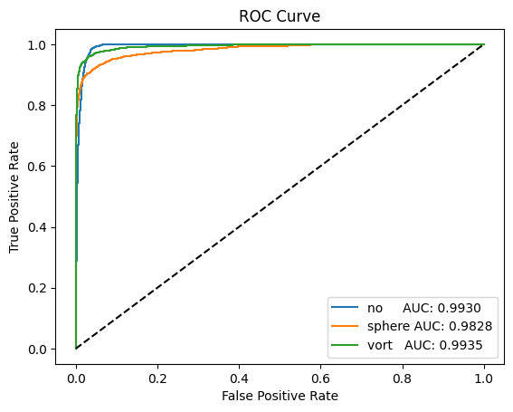
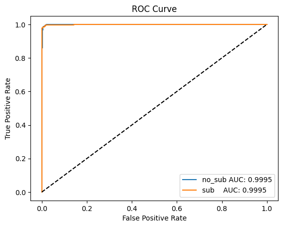
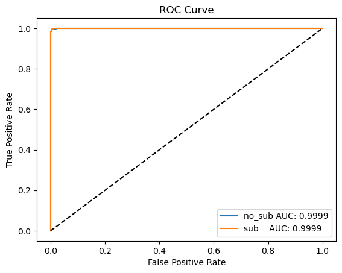
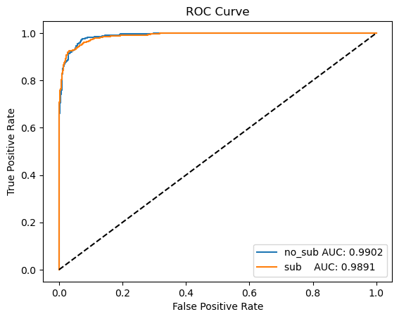
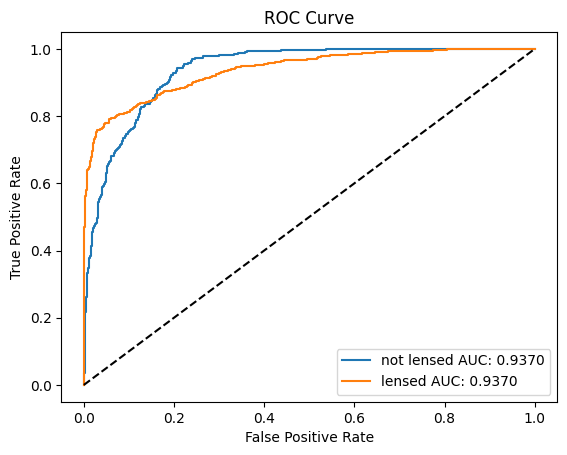

# ML4SCI - DeepLense Submission 2023

This repository contains the code for the DeepLense submission to ML4SCI for GSoC 2023.

1. [notebooks](notebooks) contains the notebooks for the tests and their results.
2. [models](models) contains the model weights.
3. [results](results) is used for storing the result images.

## Results

| Test | ROC-AUC Score | ROC Curve |
| ----------- | ------------- | --------- |
| Common Test | 0.9926442933333334 |  |
| Test 4 | 0.999952 |  |
| Test 5 - CvT | 0.99992 |  |
| Test 5 - CrossFormer | 0.99986 |  |
| Test 5 - RegionViT | 0.9891319999999999 |  |
| Test 2 | 0.9369537481702903 |  |
